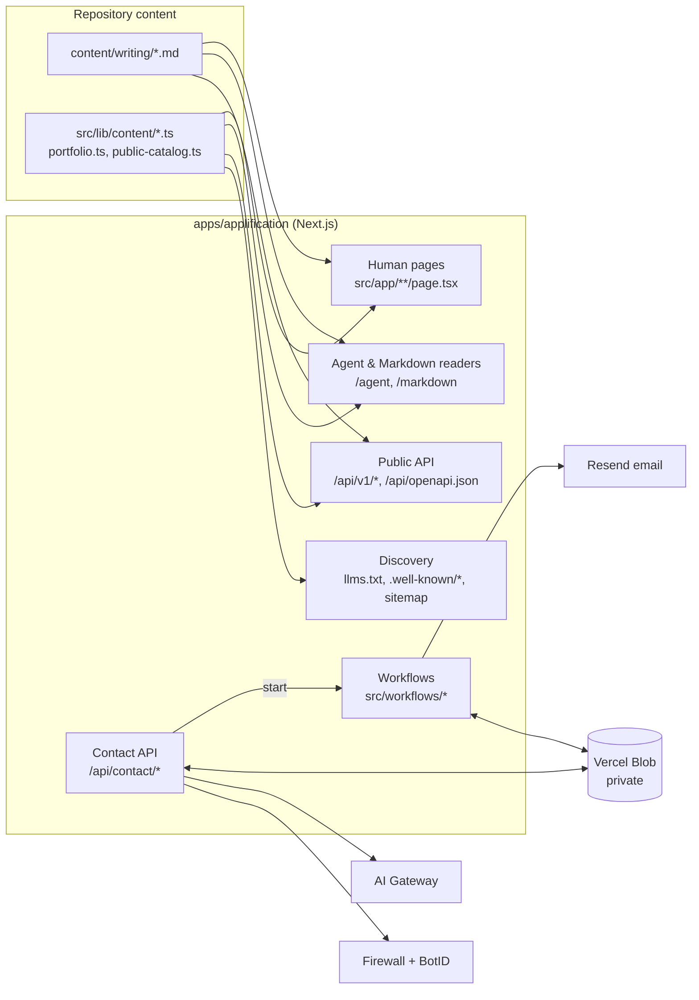
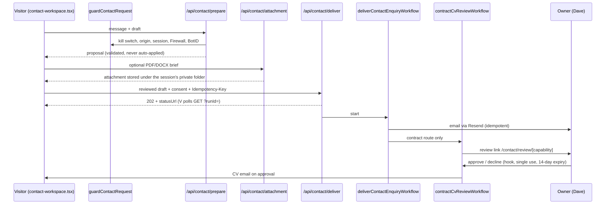

# Architecture

How the Applification website fits together: what lives where, how content reaches pages, the API and agents, and how the contact workflow runs. For day-to-day operation of the contact service, see the [contact workflow runbook](runbooks/contact-workflow.md).

## At a glance

- **Framework:** One Next.js 16 App Router app, `apps/applification`, in a Bun workspace. React 19, Tailwind 4 and shadcn/Radix components.
- **Hosting:** Vercel. The contact workflow depends on Vercel-only services: BotID, Firewall, Blob, Workflow and AI Gateway.
- **Rendering:** Mostly static. About 107 routes are prerendered at build time, including every article. The dynamic routes are the API, the contact endpoints, the owner review page and the Agent/Markdown readers.
- **Content:** Stored in the repository: articles as Markdown in `content/writing`, and page copy, products and case studies as TypeScript in `src/lib/content` and `src/lib/*`. There is no CMS or database.
- **Durable state:** The only durable state is the contact workflow's, held in Vercel Workflow runs and private Vercel Blob storage.



## Repository layout

```text
apps/applification/
  content/writing/        Articles and weeknotes (Markdown + frontmatter)
  public/                 Static assets; article media in public/images/writing
  scripts/                One-off content import and the skills sync script
  src/app/                Routes: pages, route handlers, metadata, OG images
  src/components/         UI, grouped by area (home, products, writing, contact, agent-info, ui)
  src/lib/                Domain logic, content loaders, schemas and helpers (no React)
  src/lib/content/        Authored page copy shared by the human and Agent views
  src/workflows/          Vercel Workflow definitions for the contact service
  .storybook/             Storybook config (a11y checks run as tests)
docs/                     Repository-level docs (this file, runbooks, agent readiness, audit)
skills/                   Generated copy of the site skill that skills.sh indexes
applification.pen         Design file (visual intent; design-tokens.test.ts reads it)
```

### Conventions

- **`src/lib` holds plain TypeScript.** It has no React and is unit tested in Node. Route handlers and components stay thin and call into it.
- **Files ending in `.server.ts` read the filesystem or secrets.** Never import them into a `"use client"` component. Modules that import `node:crypto` or `node:fs` are server-only as well, even without the suffix. For example, `contact-attachment-owner.ts` and `writing.ts`.
- **zod validates every boundary:** frontmatter, rich blocks, API query strings, contact requests, model output and workflow hook payloads. Schemas are `.strict()`.
- **The OpenAPI document (`/api/openapi.json`) is generated from the same zod schemas** in `src/lib/public-api-schema.ts`, so the documented API can't drift from validation.

## Content pipeline

### Writing

1. **Source.** Each article is a Markdown file in `content/writing`. Its frontmatter (`title`, `date`, `type: post | weeknote`, `summary`, `topics`, `draft`, `slug` and so on) is validated by `writingFrontmatterSchema` in `src/lib/writing.ts`.
2. **Loading.** `getWriting()` reads and parses every file with gray-matter and zod. It also validates "rich blocks", which are fenced code blocks that render link previews, YouTube facades, tweets and bespoke diagrams (`src/lib/rich-blocks.ts`, `rich-block-registry.ts`).
3. **Rendering.** `/writing/[slug]` is prerendered for every published article (`dynamicParams = false`). `react-markdown` renders the body without raw HTML. The article renderer turns `.mp4` and `.webm` image references into click-to-play `<video>` elements with a poster frame.
4. **Legacy URLs.** `/posts/*` and `/weeknotes/*` permanently redirect to `/writing/*`.
5. **Drafts.** Drafts are excluded everywhere: pages, sitemap, API and Markdown. They can be previewed only in development at `/writing/preview/[slug]`.

`src/lib/writing-media.test.ts` fails the build if any article image has empty alt text, if a GIF is reintroduced, or if a local image, video or poster is missing.

### Pages, products and case studies

- **Page copy** that appears in both the visual page and the Agent view lives in `src/lib/content/*.ts` (`about.ts`, `privacy.ts`, `site-pages.ts`, `client-work.ts`, `product-details.ts`).
- **Products:** the slugs, names and status come from `src/lib/portfolio.ts`, and `src/lib/public-catalog.ts` adds the public profile, pricing and onboarding facts used by the API, WebMCP and JSON-LD.
- **Known debt:** some product copy is still hard-coded in the product page components. The audit recommends a single product and route registry; see `docs/audit-2026-09.md` M2.

## Human and Agent views

Every supported public page has three representations:

| URL | What it is |
| --- | --- |
| `/about` | The human page |
| `/agent/about` | The same content as Markdown inside the site shell, with a graphite theme, `noindex`, and a canonical link to the human page |
| `/markdown/about` | Plain `text/markdown` with CORS and a canonical `Link` header |

- `src/lib/page-view.ts` decides which paths have an Agent view.
- `src/lib/page-markdown.server.ts` builds the Markdown for each route from the same loaders the human pages use.
- The floating Human/Agent switch (`page-view-switch.tsx`) animates between the two with a View Transition, and falls back to plain navigation under reduced motion.

To add a new page to the Agent view:
1. Add its path to `page-view.ts`.
2. Add a case in `getPageMarkdown`.
3. Add it to `sitemap.ts` and `llms.txt` if it should be discoverable.

## Public API, agents and discovery

- **`/api/v1/catalog`**: the profile, products and pricing, from `public-catalog.ts`.
- **`/api/v1/search`**: searches published writing, client work and products.
- **`/api/v1/content`**: reads one Markdown section at a time.
- **`/api/v1/sandbox`**: an anonymous first call that confirms there are no keys and a free tier.
- **Behaviour shared by all of the above:**
  - Anonymous, read-only and CORS-enabled.
  - Validated with strict zod query schemas; errors use `{ error: { code, message } }`.
  - Rate-limited to 120 requests per minute per IP, in memory on each instance (`public-api-rate-limit.ts`).
- **`/api/openapi.json`**: the OpenAPI 3.1 document, generated from zod.
- **WebMCP tools** (`src/lib/webmcp.ts`) wrap the same endpoints. `WebMcpTools` loads them only in browsers that expose `modelContext`. The contact page registers an extra `fill_contact_draft` tool.
- **Discovery:**
  - `/llms.txt`, `/sitemap.xml` and `/robots.txt`, which has explicit AI crawler tiers.
  - `/.well-known/agent-skills/*` and `/.well-known/ard.json`.
  - JSON-LD from `structured-data.tsx`.
- **The site skill** is generated from `src/lib/agent-skills.ts`. `bun run skills:sync` writes the copy in `skills/` for skills.sh, and a unit test fails if the two drift.

See [agent readiness](agent-readiness.md) for the detail and verification commands.

## Contact workflow

The contact page is an AI-assisted brief builder. The visitor writes freely, a model proposes structured fields, the visitor reviews and edits every field, and only then is anything sent. It has three routes: contract, product and general.



### Layers

- **UI:** `src/components/contact/contact-workspace.tsx`. It holds the conversation, route choice, attachment upload, review and editing, and delivery polling. The pure state rules live in `src/lib/contact-state.ts` and `contact-draft.ts`.
- **Guard:** `src/lib/contact-request-guard.ts` runs before every write. The checks run in this order:
  1. The kill switch (`CONTACT_WORKFLOW_ENABLED`).
  2. The Origin allowlist.
  3. The `x-contact-session` UUID header.
  4. The Vercel Firewall `contact-write` rule, once per IP and once per session.
  5. BotID.

  The guard fails closed with a 503 when protection can't be checked. Firewall and BotID are skipped in development and test.
- **Preparation:** `src/lib/prepare-contact.ts` calls the AI Gateway in JSON mode, with at most two attempts, 25 seconds each. The model's output is validated against `contactProposalSchema`. The model has no tools, can't choose recipients, and its output is only ever a proposal.
- **Attachments:** `src/app/api/contact/attachment/route.ts`.
  - Uploads are checked by magic bytes, and the extension and declared type must match the contents.
  - Files are stored privately at `contact/unsubmitted/<owner-tag>/<name>-<random>.<ext>`. The owner tag is an HMAC of the visitor's session (`contact-attachment-owner.ts`), so only that session can delete the file or send it.
  - Every upload schedules `expireContactAttachmentWorkflow`, which deletes the file after 7 days.
- **Delivery:** `src/app/api/contact/deliver/route.ts`.
  - It validates the draft, checks the honeypot and minimum typing time, confirms that the attachment is owned and matches its blob, and deduplicates by Idempotency-Key.
  - It then starts `deliverContactEnquiryWorkflow`.
  - The status endpoint returns only what the visitor already knows: `route`, `sentFields` and `cvFollowUpRequiresApproval`.
- **Workflows:** `src/workflows/`.
  - `contact-delivery.ts` sends the enquiry email with a Resend `Idempotency-Key`. For contract enquiries, it also starts the CV review workflow.
  - The CV review waits on a single-use hook, `contactCvDecisionHook`, until Dave approves, declines, or the 14-day review expires. On approval it emails the configured private CV, retrying up to five times, and emails Dave if delivery fails.
- **Owner review:**
  - `/contact/review/[capability]` is a `noindex`, `no-referrer` page.
  - It loads the waiting hook through an HMAC capability (`contact-owner-review-capability.ts`).
  - It posts the decision to `/api/contact/cv-review`, and approval needs an explicit confirmation.
  - Analytics redacts the capability from URLs (`src/lib/analytics-redaction.ts`).

## Cross-cutting concerns

- **Security headers:** `src/lib/security-headers.ts`, applied to every route in `next.config.ts`.
  - The enforced CSP blocks third-party framing, plugins, `<base>` hijacking and cross-origin form posts.
  - The full script, connect and frame allowlist ships as `Content-Security-Policy-Report-Only` until it has been checked on a Vercel preview with BotID. The runbook has the steps.
- **Accessibility:**
  - `design.md` sets the standard: AA contrast, 44px targets, visible focus and reduced motion.
  - Storybook runs axe as a failing test (`a11y.test: "error"`), and play functions assert keyboard and focus behaviour.
  - There is a skip link, and every `<main>` has `id="main-content"`.
- **Analytics:** Vercel Web Analytics, wrapped by `SiteAnalytics`, which redacts private URLs.
- **Fonts and theme:**
  - Fonts are self-hosted with `next/font` (`src/app/fonts.ts`).
  - The theme is stored in `localStorage` and applied before paint by an inline script in `layout.tsx`.
  - Design tokens live in `globals.css`, and a test checks them against `applification.pen`.

## Testing and automation

| Layer | Tooling | Command |
| --- | --- | --- |
| Domain logic, route handlers, content checks | Vitest (`unit` project, Node) | `bun run test` |
| Durable workflows | Vitest + `@workflow/vitest` | `bun run test:workflow` |
| Components, interaction, axe | Storybook + Vitest browser (Chromium) | `bun run test:storybook` |
| Types (runs `next typegen` first) | TypeScript | `bun run typecheck` |
| Lint | ESLint flat config (Next + Storybook presets) | `bun run lint` |

- **CI:** `.github/workflows/ci.yml` runs every row of the table above, plus a production build, on each pull request and each push to `main`.
- **Dependency updates:** Dependabot opens weekly grouped updates.

## Known limits and follow-ups

The [audit](audit-2026-09.md) is the backlog. The main structural items still open are:

- **A single product and route registry** (M2), so that pages, the sitemap, `llms.txt` and the Agent view share one source.
- **Splitting `contact-workspace.tsx`** into a reducer-driven state machine plus smaller panels (M1).
- **Replacing the per-instance in-memory rate limits and delivery deduplication** with the Vercel WAF, or with idempotency inside the workflow (S8, S9).
- **Memoising content loading** and adding CDN caching for the dynamic readers (P3, P4).
